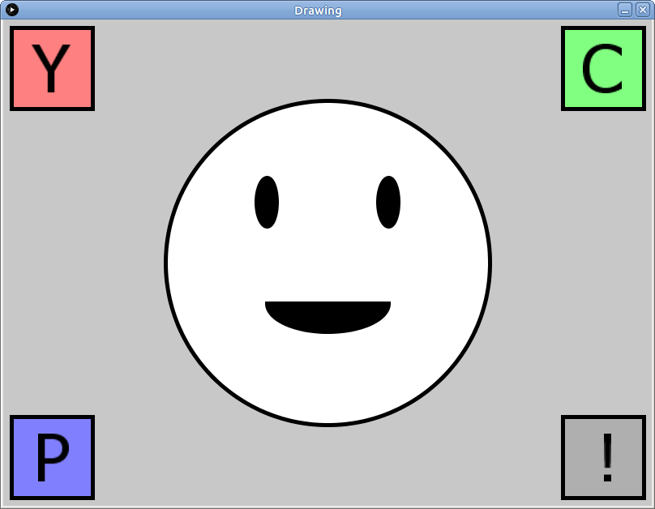

# Learning goals

* Understand the basic elements of a Processing program
* Understand how to run programs in the Processing environment
* Use Processing drawing functions to create images

# What to do

## Part 1: Setting up Processing

Start Processing by clicking the start menu, then choosing **Programs**, then **Processing**.

When Processing starts, choose **File &rarr; Preferences**.  In the **Sketchbook location** setting, enter the text

    H:\sketchbook

Quit Processing using **File &rarr; Quit**.  Then restart Processing.

## Part 1: Importing the example program

Download the following zip file and save it in your **Downloads** folder: [Drawing.zip](Drawing.zip).

Start a file browser window and navigate to your **Downloads** folder.  Right click on **Drawing.zip**.  Choose **Extract All**, then choose `H:\sketchbook` as the destination directory.  *FIXME: verify that this works.*

In Processing, choose **File &rarr; Open**.  In the file chooser dialog, navigate to the **sketchbook** folder in your home directory, the double click on **Drawing**, then choose **Drawing.pde**.  You should now have a Processing window with the source code of the example program.

## Part 3: Drawing with Processing

The program draws a smiley face and some boxes (click for full size):

> 

Things to change, see what happens.

*Read through the program*.  There are comments (lines of text beginning with "//") describing what each section of code is doing.

## Part 4: Making your own drawing

Instructions for starting a new sketch.

Goal: start translating shapes from the graph paper to the new sketch.
