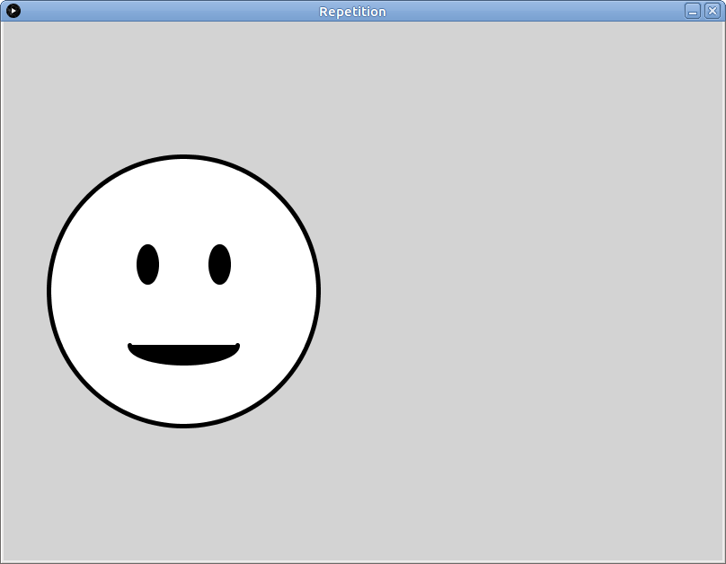

# Learning goals

* Use *procedural abstraction* to avoid repeated code when drawing similar or identical elements

# What to do

## Part 1: Import the example sketch

Download the following zip file and save it in your **Downloads** folder: [Repetition.zip](Repetition.zip).

Start a file browser window and navigate to your **Downloads** folder.  Right click on **Repetition.zip**.  Choose **Extract All**, then choose `H:\sketchbook` as the destination directory.  *FIXME: verify that this works.*

In Processing, choose **File &rarr; Open**.  In the file chooser dialog, navigate to the **sketchbook** folder in your home directory, the double click on **Repetition**, then choose **Repetition.pde**.  You should now have a Processing window with the source code of the example program.

Click the run button, which looks like this:

> 

When the sketch runs, you should see the following (click for full size):

> 

## Part 1: Using functions

Brief explanation of the program.

Things to change, see what happens.

Ideas for things to change.

## Part 2: Using a function to draw repeated elements in your sketch

Instructions for opening the sketch started in Lab 1.

Goal: create a function to draw a repeated element, use it.
