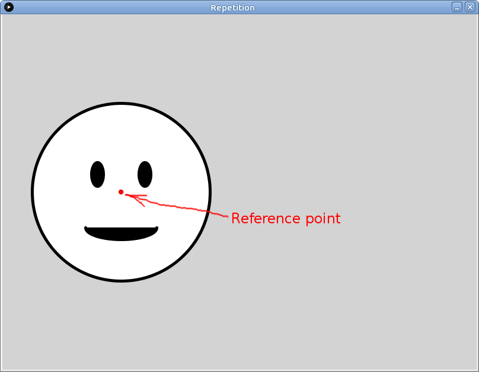
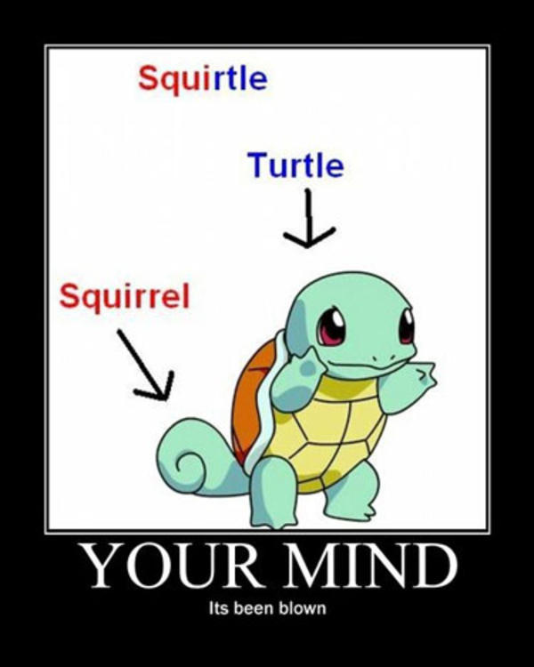

# Learning goals

* Use *procedural abstraction* to avoid repeated code when drawing similar or identical elements

# What to do

## Part 1: Import the example sketch

Download the following zip file and save it in your **Downloads** folder: [Repetition.zip](Repetition.zip).

Start a file browser window and navigate to your **Downloads** folder.  Right click on **Repetition.zip**.  Choose **Extract All**, then choose `H:\sketchbook` as the destination directory.  *FIXME: verify that this works.*

In Processing, choose **File &rarr; Open**.  In the file chooser dialog, navigate to the **sketchbook** folder in your home directory, the double click on **Repetition**, then choose **Repetition.pde**.  You should now have a Processing window with the source code of the example program.

Click the run button, which looks like this:

> 

When the sketch runs, you should see the following (click for full size):

> 

## Part 2: Repeated elements

The program is nice and all, but more smiley faces would be better.  How can we add another one?

Let's say that we want to add another smiley face to the right of the first one.  As we know from [Lab 1](lab01.html), x coordinates increase as we go to the right.  So, we could just repeat the drawing operations that draw the first face, but increase each x coordinate by a fixed amount, leaving y coordinates, width and height, and other drawing values unchanged.

So: add the following code to the `draw` function, just below the code that draws the first smiley face:


// Draw another smiley face
fill(255);
ellipse(200+400, 300, 300, 300);
fill(0);
ellipse(160+400, 270, 20, 40);
ellipse(240+400, 270, 20, 40);
arc(200+400, 360, 120, 40, 0, PI);


This code is very similar to the code that draws the first smiley face.  Note how we can just put `+400` after any value to increase it by 400.  Processing will do the math for us, which is awesome.

Run the sketch again.  What do you see now?

## Part 3: Reference point, variables

When we want to draw the same thing in more than one place, the "copy code and tweak it" approach works, but it's tedious.  What if there were a way we could use the *same* code to draw the same thing in more than one place?

Good news: there is a way!  The idea is to do all of our drawing operations relative to a *reference point*.

For our smiley face, let's put the reference point right in the center:

> 

We'll refer to the x and y coordinates of the reference point as `smileyX` and `smileyY`.  Here is how we can change the code to make all of the drawing operations relative to coordinates of the reference point:


// Draw a smiley face
fill(255);
ellipse(smileyX, smileyY, 300, 300);
fill(0);
ellipse(smileyX-40, smileyY-30, 20, 40);
ellipse(smileyX+40, smileyY-30, 20, 40);
arc(smileyX, smileyY+60, 120, 40, 0, PI);


Let's break this down.

In the first use of `ellipse`, which draws the large circle, we specify the center x and y coordinates as exactly `simleyX` and `smileyY`.  This makes sense: the circle's center is exactly at the reference point.

In the second use of `ellipse`, which draws the left eye, we want the center x coordinate to be to the left (less than) of the reference point, and the center y coordinate to be above (less than) the reference coordinate.  The original center was at (160, 270): the x coordinate is 40 units less than the big circle's original center x coordinate (200), and the y coordinate is 30 units less than the big circle's original center y coordinate (300).  So, the center x and y coordinates of the left eye become `smileyX-40` and `smileyY-30`, respectively.  (Just as `+` means "add" in Processing, `-` means "subtract.")

"That's great," you say, "but what the heck are `smileyX` and `smileyY`?  Are they real things?"  Heck yeah, they are!  Processing allows us to define *variables*: these are named storage locations where we can store information such as reference point coordinates.  All we need to do is define variables called `smileyX` and `smileyY`, and set them to the specific coordinates we want to use as the reference point.  Here's the whole shebang:


int smileyX = 200;
int smileyY = 300;

// Draw a smiley face
fill(255);
ellipse(smileyX, smileyY, 300, 300);
fill(0);
ellipse(smileyX-40, smileyY-30, 20, 40);
ellipse(smileyX+40, smileyY-30, 20, 40);
arc(smileyX, smileyY+60, 120, 40, 0, PI);


Copy this code into the sketch, replacing the original code to draw the first smiley face.  Run the sketch: you should see the first smiley face in its original location.  Not very exciting, you say?  Well try this: change the values of `smileyX` and `smileyY` as follows:


int smileyX = 250;
int smileyY = 370;


Yeah that's right: *the smiley face is now in a different place, and all you had to do was change the values of a couple variables.* Take a moment to let this sink in.

>  <a class="sourceref" href="http://knowyourmeme.com/photos/301263-mind-blown">source</a>

## Part 4: Using a function!

Brief explanation of the program.

Things to change, see what happens.

Ideas for things to change.

## Part 5: Using a function to draw repeated elements in your sketch

Instructions for opening the sketch started in Lab 1.

Goal: create a function to draw a repeated element, use it.
