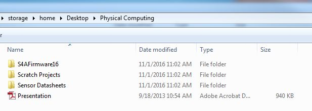

# Learning goals

* Learn to write simple programs in Scratch For Arduino
* Explore simple input and output devices in Scratch 4 Arduino

#What to Do
Before beginning this lab, please download the Physical Computing archive to your desktop. Unzip the archive and you should see the contents of a folder that look like the image below: 

> 

Each folder above will be important for the lab. The folder "S4AFirmware16" contains a program that must be installed on the Arduino to ensure it works with your computer. "Scratch Projects" contains example Scratch projects for each of the sensors and actuators we will use. "Sensor Datasheets" contains User-Friendly datasheets that describes how each sensor operates. Finally, the Presentation PDF is a former presentation on these materials that might be helpful for you.
